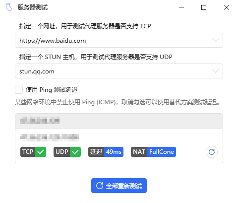

## 说明

基于asio (non-boost) + coroutine的socks5服务端



## 编译
- Windows
  - asio  (non-boost)
  - msvc142（vs2019）
  - c++20以上
  - x86

- Ubuntu
  - asio(non-boost)

  - g++-10

  - c++20以上

  - x64


1. 安装/升级g++-10

   - 更新源

     ```bash
     sudo apt-get update
     sudo apt-get upgrade
     ```

   - 查看版本

     ```bash
     gcc --version
     g++ --version
     ```

   - 升级版本

     ```bash
     sudo apt-get update
     sudo apt-get install gcc-10
     sudo apt-get install g++-10
     cd /usr/bin
     sudo rm gcc g++
     sudo ln -s gcc-10 gcc
     sudo ln -s g++-10 g++
     ```

2. 安装vcpkg

     ```bash
     sudo apt-get install curl zip unzip tar
     git clone  https://github.com/microsoft/vcpkg.git
     cd vcpkg
     ./bootstrap-vcpkg.sh
     ```

3. 用vcpkg安装asio

     ```bash
     ./vcpkg install asio:x64-linux
     ```

4. 编译

   要找到asio的include目录

   ```bash
   g++ main.cpp -I /root/vcpkg/packages/asio_x64-linux/include/ -fcoroutines -std=c++20 -lpthread
   ```

5. 运行

   ```bash
   ./a.out
   ```

   

## 已实现

- TCP代理(IPv4/IPv6/域名IPv4)
- UDP代理(IPv4/IPv6/域名IPv4)
- 2种认证模式(无认证/账号密码)

## 已知问题

- 超时后自动断开连接未实现
- UDP分片未实现（最大支持的UDP包为MAX-0x20字节）
- 域名IPv6未实现

## 特点

- coroutine天然就能解决两个关键问题：
  - TCP大小水管的问题
  - 一端发送数后立即关闭时，另一端可能会收不到的问题
- 当转发的线程不访问公共资源时，coroutine还天然支持：
  - 多线程协同工作，不需要加锁。
